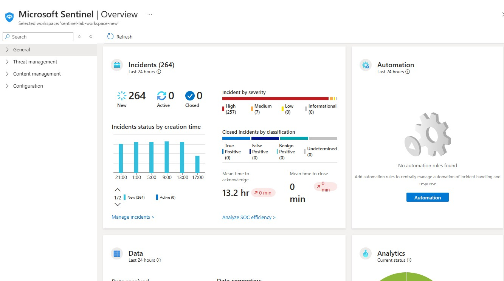
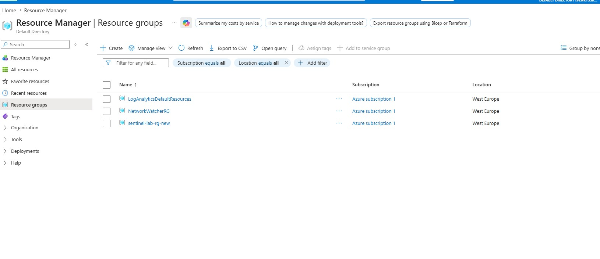
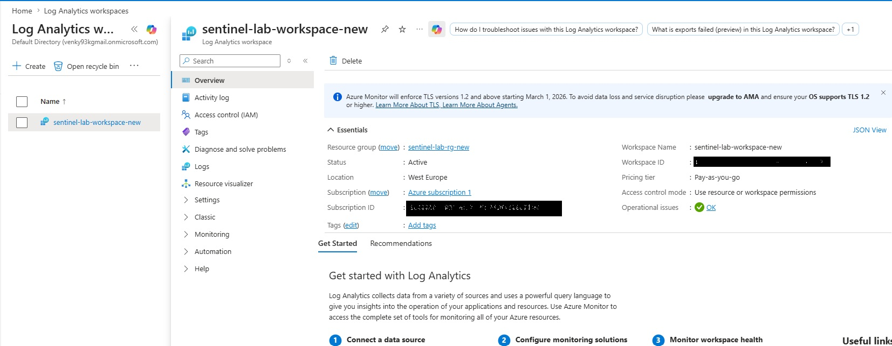
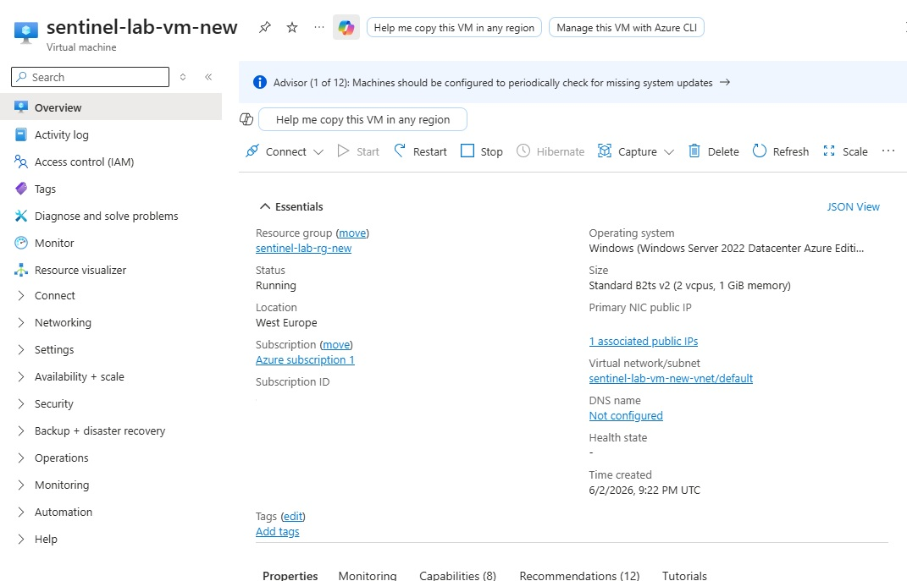
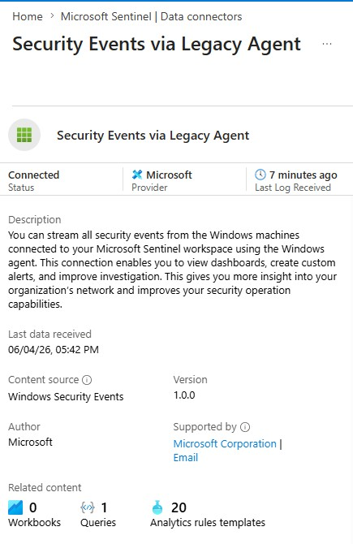
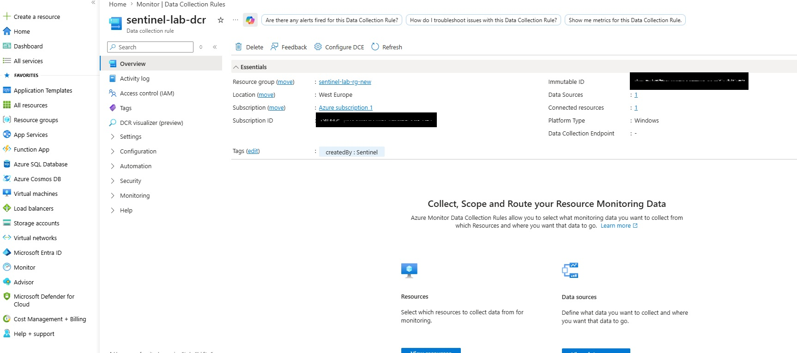
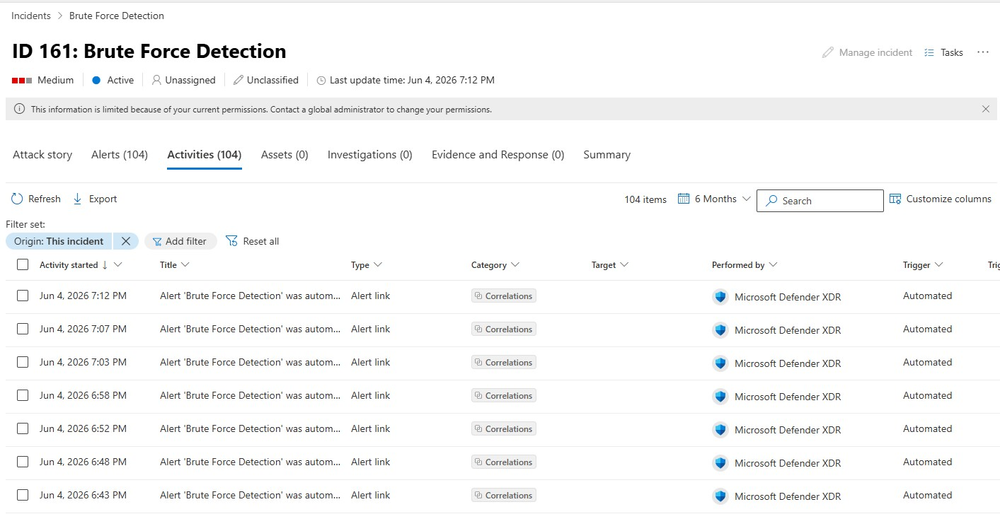
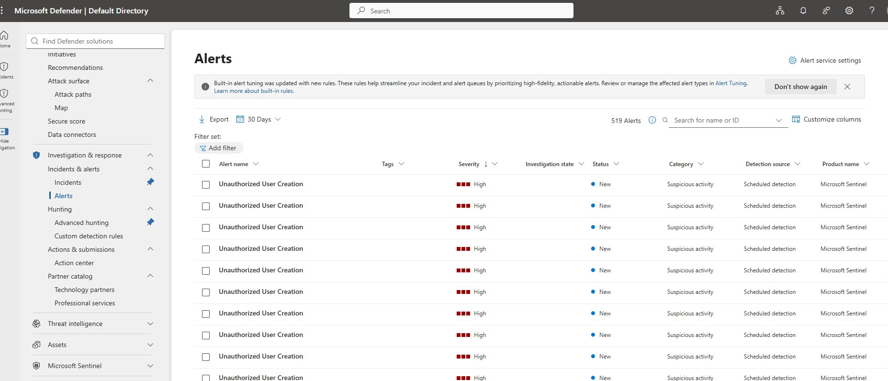
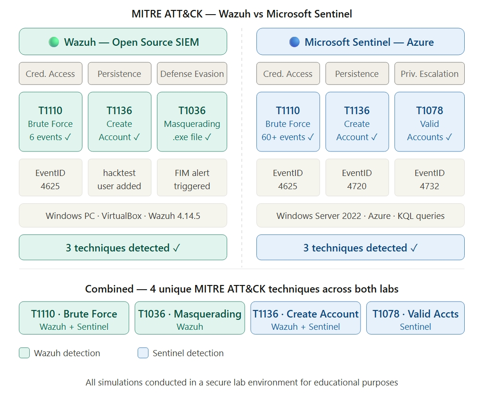

# ☁️ Microsoft Sentinel SIEM Lab

> Deployed Microsoft Sentinel on Azure to simulate, detect, and investigate real-world cyber threats using KQL queries, custom detection rules, and incident response.

---

## Table of Contents

- [Lab Architecture](#lab-architecture)
- [Tools Used](#tools-used)
- [Lab Setup](#lab-setup)
- [KQL Queries](#kql-queries)
- [Attack Simulations](#attack-simulations)
- [Detection Rules](#detection-rules)
- [Incident Investigation](#incident-investigation)
- [Key Findings](#key-findings)
- [Screenshots](#screenshots)
- [Skills Demonstrated](#skills-demonstrated)
- [References](#references)

---

## Lab Architecture

```
┌─────────────────────────────────────────────────────────────────────┐
│              Resource Group: sentinel-lab-rg-new (West Europe)       │
│                                                                       │
│  ┌──────────────────────┐   logs    ┌──────────────────────────┐    │
│  │  Windows Server VM   │ ─────────►│  Log Analytics Workspace  │    │
│  │  sentinel-lab-vm-new │           │  sentinel-lab-workspace   │    │
│  │                      │           └────────────┬─────────────┘    │
│  │  Azure Monitor Agent │                        │                   │
│  │  Standard_B2ts_v2    │           ┌────────────▼─────────────┐    │
│  │  RDP 3389 open       │           │   Microsoft Sentinel      │    │
│  └──────────┬───────────┘           │                           │    │
│             │                       │  - Analytics rules        │    │
│  ┌──────────▼───────────┐           │  - KQL queries            │    │
│  │  Data Collection Rule │──────────►  - Incident management    │    │
│  │  sentinel-lab-dcr     │           │  - MITRE ATT&CK mapping   │    │
│  │  All Security Events  │           └────────────┬─────────────┘    │
│  └──────────────────────┘                        │                   │
│                                                   │                   │
└───────────────────────────────────────────────────┼───────────────────┘
                                                    │
                                                    ▼
                               ┌────────────────────────────────┐
                               │   Microsoft Defender Portal     │
                               │   security.microsoft.com        │
                               │   Unified incidents · Hunting   │
                               └────────────────────────────────┘

Security Events Captured:
  EventID 4625 → Failed logins    → Brute Force Detection rule  → Incident ✅
  EventID 4720 → User created     → User Creation rule          → Incident ✅
  EventID 4732 → Privilege escalation (bonus simulation)        → Incident ✅

MITRE ATT&CK:
  T1110 Brute Force · T1136 Create Account · T1078 Valid Accounts
```

---

## Tools Used

| Tool | Purpose |
|---|---|
| **Microsoft Sentinel** | Cloud SIEM and SOAR platform |
| **Azure Log Analytics** | Log storage and KQL engine |
| **Windows Server 2022** | Monitored endpoint |
| **Azure Monitor Agent** | Ships logs from VM to Sentinel |
| **Data Collection Rule** | Defines what logs to collect |
| **Microsoft Defender Portal** | Unified incident management |
| **KQL** | Query language for log investigation |
| **PowerShell** | Attack simulations |

---

## Lab Setup

> ⚠️ **Critical rule: use the same region for ALL resources.**
> Mismatched regions (e.g. Log Analytics in UK West, VM in UK South) will prevent logs from flowing.

### Step 1 — Resource Group
```
Azure Portal → Resource Groups → + Create
Name: sentinel-lab-rg-new
Region: West Europe
```

### Step 2 — Log Analytics Workspace
> Always create this before the VM
```
Search: Log Analytics Workspaces → + Create
Resource Group: sentinel-lab-rg-new
Name: sentinel-lab-workspace-new
Region: West Europe
```


### Step 3 — Enable Microsoft Sentinel
```
Search: Microsoft Sentinel → + Create
Select: sentinel-lab-workspace-new → Add
```


### Step 4 — Create Windows Server VM

| Field | Value |
|---|---|
| Resource Group | `sentinel-lab-rg-new` |
| VM Name | `sentinel-lab-vm-new` |
| Region | `West Europe` |
| Availability | No infrastructure redundancy required |
| Security Type | Standard |
| Image | Windows Server 2022 Datacenter: Azure Edition Hotpatch |
| Size | Standard_B2ts_v2 |
| Username | `labadmin` |
| Inbound ports | RDP 3389 |


### Step 5 — Install Data Connector
```
Sentinel → Content Hub → Search: Windows Security Events → Install
Sentinel → Data Connectors → Windows Security Events via AMA → Open Connector Page
```



### Step 6 — Create Data Collection Rule

| Field | Value |
|---|---|
| Rule Name | `sentinel-lab-dcr` |
| Resource Group | `sentinel-lab-rg-new` |
| Region | `West Europe` |
| Resource | `sentinel-lab-vm-new` |
| Collect | All Security Events |



### Step 7 — Connect to Defender Portal
```
https://security.microsoft.com
System → Settings → Microsoft Sentinel → SIEM Workspaces
Connect: sentinel-lab-workspace-new → Set as Primary → Connect
Wait 15-30 minutes for full sync
```

### Step 8 — Verify Logs Flowing
```kusto
SecurityEvent
| take 10
```
Results appearing = logs flowing ✅

---

## KQL Queries

### All events summary
```kusto
SecurityEvent
| summarize count() by EventID
| order by count_ desc
```

### Failed logins (Event ID 4625)
```kusto
SecurityEvent
| where EventID == 4625
| project TimeGenerated, Account, Computer, IpAddress
| order by TimeGenerated desc
```

### Successful logins (Event ID 4624)
```kusto
SecurityEvent
| where EventID == 4624
| project TimeGenerated, Account, Computer
| order by TimeGenerated desc
```

### User account created (Event ID 4720)
```kusto
SecurityEvent
| where EventID == 4720
| project TimeGenerated, Account, Computer
| order by TimeGenerated desc
```

### Full security summary
```kusto
SecurityEvent
| summarize
    TotalEvents = count(),
    FailedLogins = countif(EventID == 4625),
    SuccessfulLogins = countif(EventID == 4624),
    UserCreated = countif(EventID == 4720),
    UserDeleted = countif(EventID == 4726)
```

### Brute force detection
```kusto
SecurityEvent
| where EventID == 4625
| summarize FailedAttempts = count() by Account, Computer, bin(TimeGenerated, 5m)
| where FailedAttempts >= 5
| order by FailedAttempts desc
```

---

## Attack Simulations

### Simulation 1 — Brute Force

**MITRE:** T1110 — Brute Force

**Steps:**
1. Open Remote Desktop Connection on your PC
2. Enter your VM public IP
3. Enter wrong password 6-10 times deliberately
4. Wait 5 minutes → check Sentinel Logs for EventID 4625

**Unlock account if locked:**
```
Azure Portal → VM → Reset password → Enter new password → Update
```
Or via Run Command:
```powershell
net user labadmin /active:yes
net accounts /lockoutthreshold:0
```

**Result:** 70+ failed login events captured → incident generated ✅

---

### Simulation 2 — Unauthorized User Creation

**MITRE:** T1136 — Create Account | T1078 — Valid Accounts

**Steps:**
1. RDP into VM with correct credentials
2. Open PowerShell as Administrator
3. Run:
```powershell
net user hacktest Password123! /add
net localgroup administrators hacktest /add
```
4. Wait 5 minutes → check Sentinel Logs for EventID 4720 and 4732

**Cleanup:**
```powershell
net localgroup administrators hacktest /delete
net user hacktest /delete
```

**Result:** 60+ User creation and privilege escalation detected → incident generated ✅

---

## Detection Rules

### Rule 1 — Brute Force Detection

| Setting | Value |
|---|---|
| Severity | Medium |
| Run every | 5 minutes |
| Lookup | Last 24 hours |
| Threshold | Greater than 0 |

```kusto
SecurityEvent
| where EventID == 4625
| summarize FailedAttempts = count() by Account, Computer
| where FailedAttempts >= 1
```

### Rule 2 — Unauthorized User Creation

| Setting | Value |
|---|---|
| Severity | High |
| Run every | 5 minutes |
| Lookup | Last 24 hours |
| Threshold | Greater than 0 |

```kusto
SecurityEvent
| where EventID == 4720
| project TimeGenerated, Account, Computer
| order by TimeGenerated desc
```

---

## Incident Investigation

```
Sentinel → Incidents → Click incident
1. Assign to me
2. Change status → Active
3. Click Investigate → view entity graph
4. Click Alerts tab → view raw logs
5. Add comment with findings
6. Close → True Positive
```

**Sample comment:**
```
Investigated brute force attempt on sentinel-lab-vm-new.
31 failed logins detected (EventID 4625). Account lockout triggered.
No lateral movement detected. Confirmed lab simulation.
Closing as True Positive — Simulated Attack.
```

---

## Key Findings

| # | Simulation | Event ID | MITRE | Severity | Status |
|---|---|---|---|---|---|
| 1 | Brute Force | 4625 | T1110 | Medium | ✅ Detected |
| 2 | Account lockout triggered | 4740 | T1110 | High | ✅ Detected |
| 3 | Unauthorized user account created | 4720 | T1136 | High | ✅ Detected |
| 4 | User added to Administrators group | 4732 | T1078 | High | ✅ Detected |



**Windows Event ID Reference:**

| Event ID | Description |
|---|---|
| 4624 | Successful login |
| 4625 | Failed login |
| 4720 | User account created |
| 4726 | User account deleted |
| 4732 | User added to privileged group |
| 4740 | Account locked out |

---

## Skills Demonstrated

- ✅ Microsoft Sentinel — deployed and configured from scratch
- ✅ Azure infrastructure — correct region configuration across all resources
- ✅ KQL — wrote 6 custom investigation queries
- ✅ Detection rules — created 2 custom scheduled analytics rules
- ✅ Incident management — investigated, assigned, and closed incidents
- ✅ Attack simulation — brute force and account creation
- ✅ MITRE ATT&CK — mapped T1110, T1136, T1078
- ✅ Microsoft Defender Portal — connected Sentinel for unified SOC operations

---

## References

- [Microsoft Sentinel Docs](https://learn.microsoft.com/en-us/azure/sentinel/)
- [Connect Sentinel to Defender Portal](https://learn.microsoft.com/en-us/unified-secops/microsoft-sentinel-onboard)
- [KQL Reference](https://learn.microsoft.com/en-us/azure/data-explorer/kql-quick-reference)
- [Windows Event IDs](https://www.ultimatewindowssecurity.com/securitylog/encyclopedia/)
- [MITRE ATT&CK](https://attack.mitre.org)

---

**Venkat Kannan**
🌐 [venkatkannan.com](http://www.venkatkannan.com) · 📧 venkat@venkatkannan.com · 🐙 [github.com/venkatkannan-infra](https://github.com/venkatkannan-infra)

> *For educational purposes only. All simulations conducted in a controlled Azure environment.*
